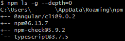
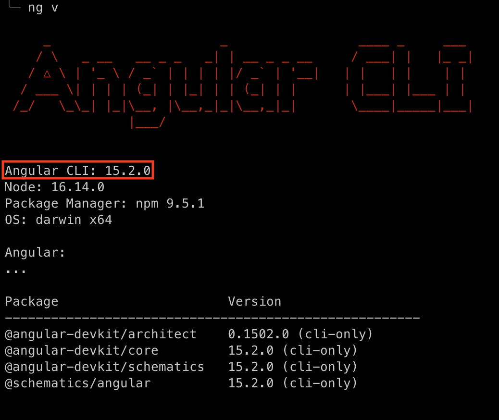

# InfoMapper / Development Environment / Angular #

The InfoMapper uses Angular for development and testing. Angular is a Google created
application framework and development platform for creating mobile and desktop single-page
web apps.

A single-page application (SPA) is an app that works inside a browser and does not
need to reload the page during use. There are pros a cons of both this approach and
a traditional multiple-page application (MPA). When using a MPA, each change on the
site submits data back to a server to request the rendering of a new page in the browser.
Many newer websites are taking advantage of the SPA and its speed.

If this documentation has been followed in sequence, Node and npm have already been
installed, as it is required by Angular for installation. If Node has not been installed,
instructions can be found [here](../node).

## Checking Installed Global npm Packages ##

Confirm globally installed npm packages with the command:

```bash
npm ls -g --depth=0
```

This will display any globally installed npm packages, which should also show npm
itself if going through this documentation in order. If the Angular Command Line
Interface (CLI) is already installed, it will look show up as well. An example would
look something like:



Technically, a global version of the CLI is not required for development of the
InfoMapper in and of itself, but is highly recommended for the possible creation
of new Angular projects in the future. More information can be found at this
[Stack Overflow question](https://stackoverflow.com/questions/44525746/global-angular-cli-version-greater-than-local-version).

If the Angular CLI has already been installed (`@angular/cli@<VERSION>`), the installation
section below can be skipped.

## Installing the Angular CLI globally ##

The Angular CLI is used to perform a variety of ongoing development tasks, and the
InfoMapper uses it for testing purposes and deployment. Note that the InfoMapper
uses a *local* version of the CLI to perform these tasks, installed when running
the `npm install ...` command inside the project. As stated in the
previous section, a global version is still recommended, as there are cases when
the global `ng` command will need to be used. To install, run the following command:

```bash
npm install -g @angular/cli
```

Now that the Angular CLI has been installed globally, its commands can be used. To
confirm the CLI installation was successful, use the command:

```bash
ng version
```

or

```bash
ng v
```

This will display the Angular CLI version, Node version, Operating System, and Angular core version.
It should look something like this:



## Updating the global Angular CLI ##

Keeping the global CLI and local CLI version the same is not necessary, as theoretically,
many different Angular projects could exist on the same machine. It is not sustainable
to keep them all at the same version; Angular updates so often it would become a
full time job just for that.

It is recommended however, to try to keep them at the same major version if possible,
but again, will probably not effect development. Updating the globally installed
CLI seems to possibly have nuances to it, but the following 2 commands should be
enough:

```bash
npm uninstall -g @angular/cli
npm install -g @angular/cli@latest
```

For a more in-depth explanation, or any troubleshooting, see the following
<a href="https://stackoverflow.com/questions/43931986/how-to-upgrade-angular-cli-to-the-latest-version"
target="_blank">
    Stack Overflow question
</a>.