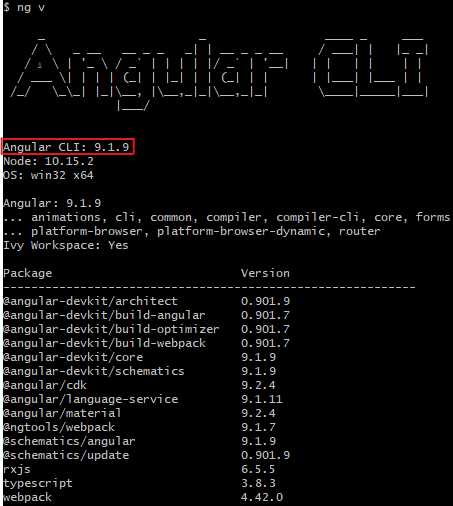

# InfoMapper / Development Environment / Angular

The InfoMapper uses Angular for development and testing. Angular is a Google created application
framework and development platform for creating mobile and desktop single-page web apps.

A single-page application (SPA) is an app that works inside a browser and does not need to reload
the page during use. There are pros a cons of both this approach and a traditional multiple-page
application (MPA). When using a MPA, each change on the site submits data back to a server to request the rendering
of a new page in the browser. Many newer websites are taking advantage of the SPA and its speed.

If this documentation has been followed in sequence, Node and npm have already been installed, as it
is required by Angular for installation. If Node has not been installed, instructions can be found
[here](../node).

### Checking Installed Global npm Packages

To confirm what npm packages have been installed globally on the system, the command

```
npm ls -g --depth 0
```

can be used. This should display the globally installed version of npm. If the Angular
Command Line Interface (CLI) is already installed, it will look show up as well. An example
would show something like this:


If the Angular CLI has already been installed, the next section can be skipped.

----

## Installing the Angular CLI

The Angular CLI is used to perform a variety of ongoing development tasks, and the InfoMapper uses it
for testing purposes and deployment. To install, run the following command:

```
npm install -g @angular/cli
```

This will install it globally, and the npm ls command from above can be used to confirm the
installation. Now that the Angular CLI has been installed, its commands can be used. To confirm
the CLI installation has been successful, type in the command

```
ng version
```

or

```
ng v
```

This will display the Angular CLI version, Node version, Operating System, and Angular core version.
It should look something like this:


