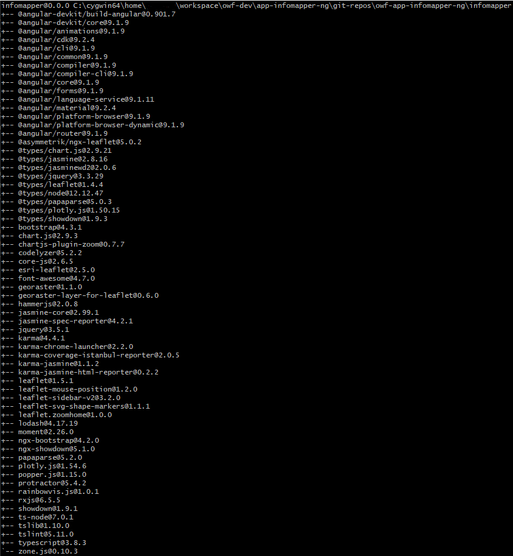

# InfoMapper / Development Environment / Node.js

# Node.js

Node.js is a run-time environment that includes everything needed to execute a program written in JavaScript. It is
required for Angular to be installed, and for the ability to run the InfoMapper in a developing environment. The
InfoMapper uses TypeScript as the coding language which is a superset of JavaScript. That is to say, TypeScript
code will be transpiled to JavaScript before it is run, so all valid JavaScript is TypeScript. TypeScript is used
instead of JavaScript for InfoMapper development for a number of reasons, with the most useful being that
TypeScript offers:

1. Static Typing
2. Classes
3. Interfaces
4. A more concrete way to utilize Object-Oriented Programming

Node.js will take the transpiled TypeScript and allow the InfoMapper to be run locally.

## Installation

Download the latest stable release by going to the Node.js website at
<a href="https://nodejs.org/en/download/" target="_blank">https://nodejs.org/en/download/</a>.
Confirm by checking the installed version with the command

```
node -v
```

----

# Node Package Manager

Node's Node Package Manager (npm) is a manager for JavaScript packages. Angular and the InfoMapper both use
packages from the npm registry that are crucial for the project. Since npm came from the same people that
created Node.js, npm is automatically installed when node is installed.

Confirm  by checking the installed version with the command

```
npm -v
```

Whereas Node only has one globally installed version of itself, npm has both a global and locally installed
version. The reason for this is because the developers knew that users could potentially have many
projects using npm on one machine, and it would be better to support different packages with distinct versions
for each.

There are two ways to install npm packages: globally and locally. Installing packages globally are beyond the
scope of this documentation, as the InfoMapper will only use locally installed packages. When npm packages are
installed, each one is put into the `node_modules` folder. This folder is ignored by Git (or other version
control systems) since it can be large in size.

When cloning the InfoMapper onto a local system, the commands 

```
npm install
```

or

```
npm i
```

will need to be used in the top-level directory `infomapper`. This will look at the `package.json` file, and
determine what packages and versions of each need to be downloaded. Another way to tell if a folder is
top-level for a local npm project is by checking if the `package.json` file exists.

### Locally Installed npm Packages

Locally installed packages can be viewed by residing in the directory where a project is using
npm installed packages. As discussed above, it is `infomapper`. The command to view the packages installed for a
project is

```
npm ls --depth=0
```

and will look something like this:


