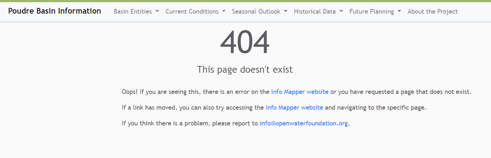

# InfoMapper / Introduction #

* [Introduction](#introduction)
* [InfoMapper Features](#infomapper-features)
* [InfoMapper Open Source Project](#infomapper-open-source-project)

---------------

## Introduction ##

There is often a need to automate processing of information products and publish to the cloud
so that users can access with a web browser.
For example, the Open Water Foundation often processes spatial data related to water resources and land use,
such as processing river basin data to better understand water resources issues.

Although open source (e.g., Leaflet, Google Maps) and commercial (e.g., Esri ArcGIS Online)
software tools are available to create web maps,
the features of these tools may be limiting and have a cost barrier.
There is a need for tools that can automate spatial data processing and publish information products.
The OWF InfoMapper software is intended to provide a simple and flexible cloud publishing tool.

> IMPORTANT NOTE: When the InfoMapper was started, it contained all files needed for
the product to work. Over time, OWF made the decision to break up the code so that the InfoMapper
became a shell that could create menus and static content pages only. The main functionality
of the InfoMapper was moved to the
[AppDev GitHub Repository](https://github.com/OpenWaterFoundation/owf-app-dev-ng) and created
as an Angular library that will be referred to as the **Common library** or **Common package**.
The library contains compartmentalized, commonly used code that can be granularly imported
into other applications. This documentation will occasionally bring up this repository, as
it is integral to running, testing, and deploying the InfoMapper. As a developer, it will be
necessary to clone the AppDev repo if any updates or changes want to be done.

## InfoMapper Features ##

The InfoMapper provides general features for displaying map and other information products.
The general InfoMapper software is used with custom configurations and data to create custom applications.
The full workflow is designed to work with GitHub (or other) repositories and workflow automation
using GeoProcessor, TSTool, and other software so that solutions can be efficiently updated and scaled.

The following image illustrates the main InfoMapper interface.
The menu bar provides access to information products and the main part of the window is used to display
maps and other information products.

**

**

**

InfoMapper Example (<a href="../InfoMapper-main.png">see full-size image</a>)

**

## InfoMapper Open Source Project ##

The Open Water Foundation is involved in multiple open source software projects that
seek to increase access to data and improve transparency on complex water issues.

The InfoMapper is a major project that OWF has undertaken as an independent OWF product.
The goal is to provide a significant new option for publishing information products,
while leveraging open data standards and open source software tools.
OWF seeks and accepts funding to enhance the software, provide training,
and implement the software on projects.

Use the [InfoMapper repository issues page](https://github.com/OpenWaterFoundation/owf-app-infomapper-ng/issues)
or contact project maintainers to provide input.
Other repositories may be used to track issues on specific implementations.
