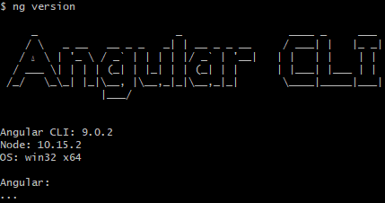
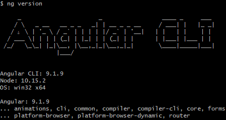
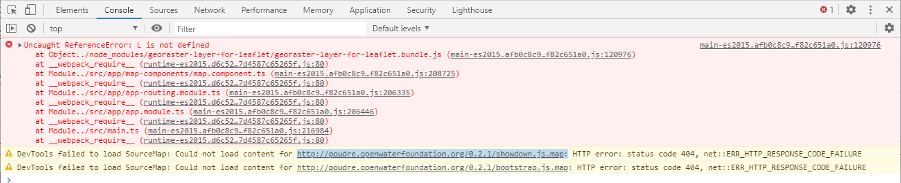

# InfoMapper / Troubleshooting #

Need to fill out similar to GeoProcessor.  Include common node and Angular error messages and solutions.

* [Angular](#angular)
* [GeoProcessor](#geoprocessor)
    * [Incorrect Paths](#incorrect-paths)
* [NPM Installation](#npm-installation)
* [Raster-Layers](#raster-layers)
* [Repository Issue Tracking](#repository-issue-tracking)

----

## Angular

Just like with installed npm packages, the Angular developers realized that other developers
would have more than one Angular project on a machine, so there is a globally installed Angular
Command Line Interface (CLI). From anywhere, the version currently installed can be viewed with
the command:

```
ng version
```

If not currently in an Angular project, the output will show the global Angular CLI version at the
top, followed by the Node version, Operating System info, and the local Angular project version.
Since there is none in this case, it will be empty, and will look something like this:



Using the same command while inside an Angular project will produce something like the following:



----

## GeoProcessor

The GeoProcessor is what creates the a JSON file that the InfoMapper knows as the map configuration file.
It can do much more as well, and the user documentation can be found
[here](https://software.openwaterfoundation.org/geoprocessor/latest/doc-user/).
Documentation for creating map configuration files can be found at the
[GeoMapProject](https://software.openwaterfoundation.org/geoprocessor/latest/doc-user/appendix-geomapproject/geomapproject/).

The GeoProcessor greatly helps with the creation of geoMapProjects so that geoLayers, geoLayerViews,
and other parts of the geoMapProject so that they contain correct ID's and other references. In doing
this, it helps assure that a JSON file is made in a way that the InfoMapper can parse it to be displayed
on a map. Sometimes however, other issues can arise from incorrect data in the fields in a geoMapProject.

### Incorrect Paths

One of the more common issues for maps not displaying is providing incorrect paths to files. These
could be `.json`, `.geojson`, `.csv`, `.stm`, `.dv`, and possibly others. Try to keep this in mind
when supplying the GeoProcessor with these paths. More information on how paths are used (absolute 
or relative) by the InfoMapper can be viewed at the
[user documentation](https://software.openwaterfoundation.org/infomapper/latest/doc-user/appendix-install/app-config/#path-specification).

This can also include typos in the path, or the file not existing where it should. Open Water
Foundation is actively trying to update and improve any errors for developers as well. If an
error message is ambiguous or confusing, an issue can be created at the
[InfoMapper Github repository](https://github.com/OpenWaterFoundation/owf-app-infomapper-ng/issues).

----

## NPM Installation

After using the command to install the npm packages needed by the InfoMapper, there will be a few
different messages displayed along with the confirmation. There will be some npm warn messages,
but these can be ignored. The last couple lines will say to run

```
npm audit fix
```

and

```
npm fund
```

----

Neither are required for the InfoMapper. Indeed, using `npm audit fix` will cause some InfoMapper
packages to mismatch, and it won't be able to run. `npm audit fix` attempts to go through each
package, dependency, and peer dependency to check for security vulnerabilities. `npm fund` is
a way for creators of a package to let the user know that any funding will help further work
and/or support for the package. Both of these can be ignored.

## Raster Layers ##

The InfoMapper uses Leaflet for maps and has many options for showing vector layers, but a surprisingly
small amount of built-in options for raster layers. It mainly treats basemap (or background) maps as
rasters and that's about it. To actually show a raster layers, a third-party package was decided upon.
It was created by two developers, and its documentation was unfortunately lacking in some areas. A problem
that OWF had to get through dealt with how this package, named `georaster-layer-for-leaflet`, is packaged
and called in a deployed setting.

This means that when working on a local testing server, the InfoMapper loaded everything in as normal, but
when tried to push to Amazon S3 to be deployed on the internet, errors occurred. Essentially, the issue
was that this package was trying to use Leaflet (which it extends from) before Leaflet was actually created.


<p style="text-align: center">[See full-size image](../images/georaster-error.png)</p>

The solution that OWF came up with was to add the HTML tag defer to the
end of the script that calls the main-es2015:

```javascript
<script src="main-es2015.3c2070bf8d0b1491e484.js" type="text/javascript" defer>
```

This ensures that the scripts go in order, as opposed to async, in which case order doesn't matter. Leaflet
should be known, and the georaster package should have no more issues extending the Leaflet L object
and doing what it needs to.

## Repository Issue Tracking ##

An issue may be due to a software bug or planned enhancement. See the
[InfoMapper GitHub repository issues](https://github.com/OpenWaterFoundation/owf-app-infomapper-ng/issues)
for a list of known issues. New bugs and feature requests can be added to alert developers.
