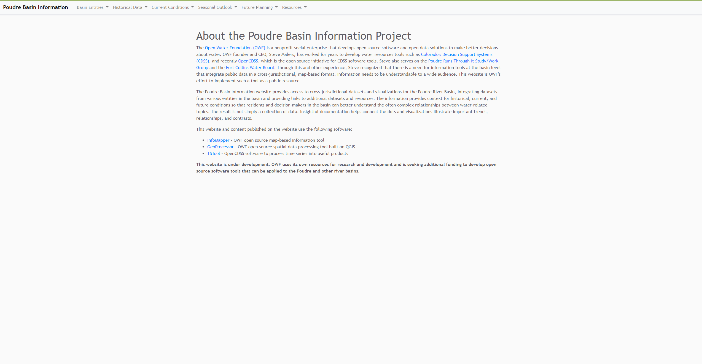

# InfoMapper / User Interface (UI) Design #

The InfoMapper user interface (UI) and user experience (UX) have both been taken into consideration
when developing. The UI has been separated into four main parts of a map, and one for a Content Page.

## Infomapper Map

The InfoMapper dedicates most of the screen to displaying a map, as it is arguably the most
important part of the InfoMapper. An example map would look like this:

[See full-size image](../images/infomapper-map.png)

## InfoMapper Sidebar

Similar to many map viewing user interfaces, the InfoMapper will display a sidebar with layer
information and a map legend:

[See full-size image](../images/infomapper-map-sidebar.png)

## InfoMapper Control

The InfoMapper will show relevant information to the selected layer or other useful mapping
tools on top of the map:

[See full-size image](../images/infomapper-map-control.png)

## InfoMapper Menus

Menus have been put at the top of the InfoMapper for easy access to each map, content page, or
external link:

[See full-size image](../images/infomapper-map-menus.png)

## InfoMapper Content Page

A content page is a markdown file shown as HTML, and nothing else is done from a user interface
point of view. For user experience, all clicks from a content page will open in a new tab. An
example of a Content Page will look like this:

[See full-size image](../images/infomapper-content-page.png)

